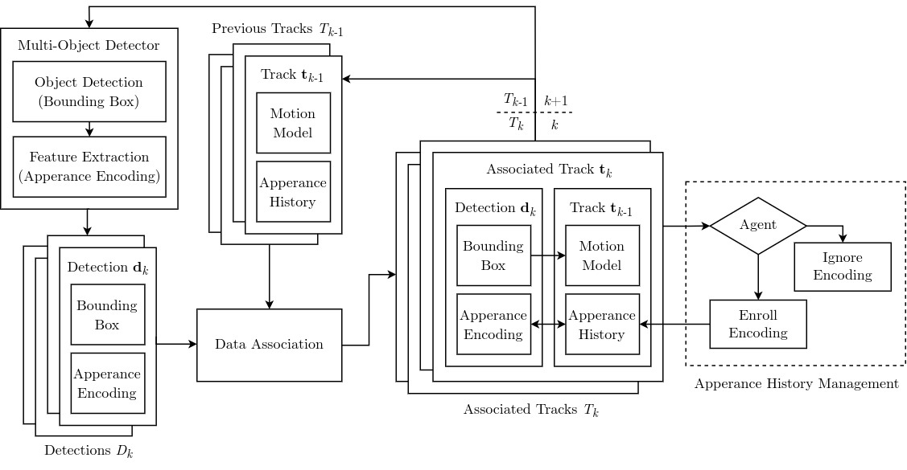
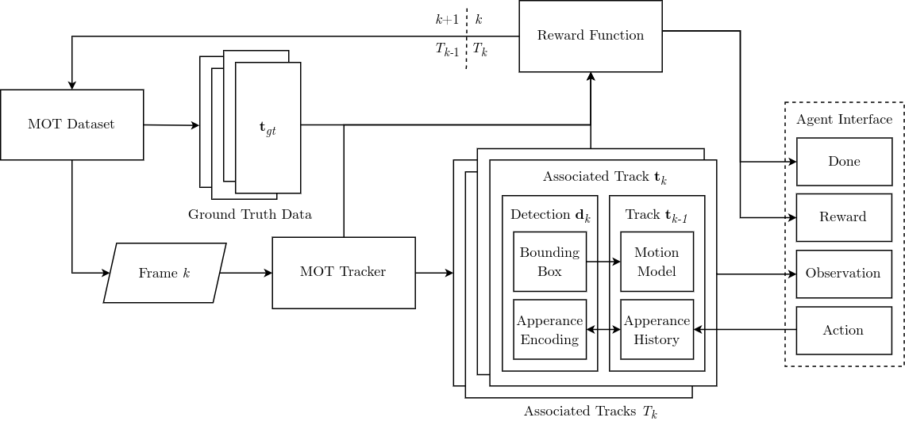

# Apperance History Management (AHM) Agent

## Agent Overview



## Environment Overview



Useful Commands:

```bash
# Check GPU Compute Ability
nvidia-smi --query-gpu=compute_cap --format=csv

# Check CPU Core Usage
top # Then press 1
```